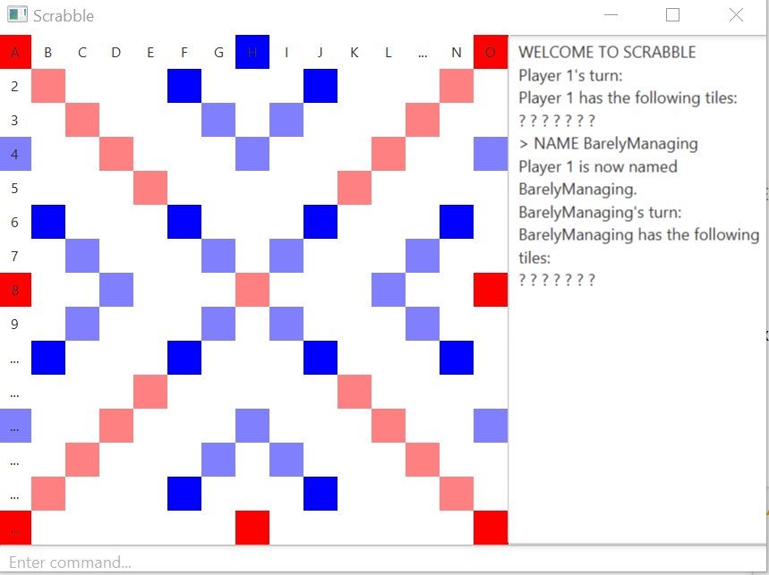

# Scrabble
GUI Implementation of the board game **Scrabble**

##Usage
Ensure that you first have the [Java JDK](https://www.oracle.com/java/technologies/javase/javase-jdk8-downloads.html),
not the SE.

**Note: The JDK contains the Java SE and JRE**

Run **Main.java** to execute the program

Download the [JavaFX](https://openjfx.io/) library that correlates to your
JDK. 
Add the library to your IDE from the Jetbrains
site and add the VM options.

Follow the link to [setup](https://www.jetbrains.com/help/idea/javafx.html)

##Working Process
This was our first ever team project(with 3). Following multiple
sprints and daily standups.

The art of OOP was used to the best of its abilites and 
Git and Github were used extensively 

##Contributions
Made by myself, [Diana](https://github.com/daianamorjolic) and [Suzanne](https://github.com/S-u-z)

